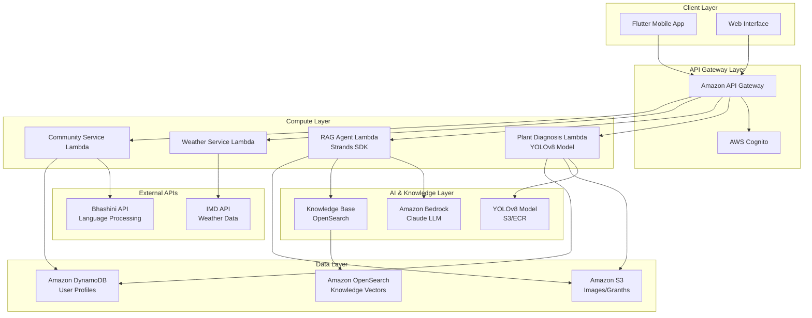

# Design Document: Krushi Ratan AI

## Overview

Krushi Ratan AI is a comprehensive Digital Ashram platform that combines modern AI technology with ancestral farming wisdom to serve Indian farmers. The system leverages AWS-native serverless architecture to deliver scalable, cost-effective solutions including plant disease diagnosis, personalized farming guidance, community interaction, and comprehensive agricultural advisory services.

The platform embodies four core philosophies:
- **Punarjeevan**: Soil rejuvenation through 100% organic recommendations
- **Atmanirbhar**: Self-reliant camera-based diagnostics
- **Sangam**: Confluence of 300+ global ancestral farming texts
- **Samriddhi**: Direct farmer-to-customer marketplace for fair pricing

## Architecture

### High-Level Architecture



### AWS-Native Serverless Architecture

**Frontend Layer:**
- Cross-platform Flutter application for mobile devices
- Progressive Web App for desktop/tablet access
- Offline-first architecture with local caching

**API Layer:**
- Amazon API Gateway with REST endpoints
- AWS Cognito for authentication and user management
- API throttling and rate limiting for cost control

**Compute Layer:**
- AWS Lambda functions for all business logic
- Container-based deployment using Amazon ECR for ML models
- Auto-scaling based on demand patterns

**AI & Knowledge Layer:**
- Amazon Bedrock hosting Claude LLM for conversational AI
- Knowledge Base built on Amazon OpenSearch for vector similarity search
- YOLOv8 model deployment for computer vision tasks

**Data Storage:**
- Amazon S3 for images, Granth files, and static assets
- Amazon DynamoDB for user profiles and application data
- Amazon OpenSearch for knowledge base vectors and search

## Components and Interfaces

### Core Modules

#### 1. Dhanvantari's Netra AI (Plant Diagnosis)
**Purpose:** Computer vision-based plant disease detection and diagnosis

**Components:**
- Image preprocessing pipeline
- YOLOv8 model inference engine
- Confidence scoring system
- Multi-language result formatter

**Interfaces:**
```typescript
interface PlantDiagnosisService {
  diagnoseImage(imageData: Buffer, metadata: ImageMetadata): Promise<DiagnosisResult>
  validateImageQuality(imageData: Buffer): Promise<QualityAssessment>
  getSupportedPlantTypes(): Promise<PlantType[]>
}

interface DiagnosisResult {
  diseaseId: string
  diseaseName: string
  confidence: number
  severity: 'low' | 'medium' | 'high'
  recommendations: Treatment[]
  localizedResult: LocalizedContent
}
```

#### 2. Rishi AI Guru (Personalized Guidance)
**Purpose:** RAG-based conversational AI for farming guidance

**Components:**
- Natural language processing pipeline
- Knowledge base retrieval system
- Response generation with source grounding
- Multi-language support integration

**Interfaces:**
```typescript
interface RAGService {
  processQuery(query: string, context: FarmerContext): Promise<GuidanceResponse>
  retrieveKnowledge(query: string, filters: KnowledgeFilter[]): Promise<KnowledgeChunk[]>
  generateResponse(chunks: KnowledgeChunk[], query: string): Promise<string>
}

interface GuidanceResponse {
  answer: string
  sources: KnowledgeSource[]
  confidence: number
  followUpQuestions: string[]
  localizedContent: LocalizedContent
}
```

#### 3. Prakriti-Parikshak (DIY Testing)
**Purpose:** Conversational interface for soil and climate assessment

**Components:**
- Multi-step questionnaire engine
- Visual instruction generator
- Data analysis and recommendation engine
- Historical trend analyzer

**Interfaces:**
```typescript
interface DIYTestingService {
  startAssessment(testType: 'soil' | 'climate'): Promise<AssessmentSession>
  processResponse(sessionId: string, response: TestResponse): Promise<NextStep>
  generateRecommendations(sessionId: string): Promise<TestResults>
}

interface TestResults {
  overallScore: number
  detailedFindings: Finding[]
  recommendations: Recommendation[]
  trendAnalysis?: TrendData
}
```

#### 4. Chanakya-Niti (Profit Analysis)
**Purpose:** Economic analysis and crop profitability calculations

**Components:**
- Market data integration
- Profitability calculation engine
- Risk assessment module
- Scenario modeling system

**Interfaces:**
```typescript
interface ProfitAnalysisService {
  analyzeCropProfitability(crop: CropType, location: Location): Promise<ProfitabilityReport>
  generateScenarios(parameters: AnalysisParameters): Promise<ScenarioResults>
  assessRisks(crop: CropType, conditions: FarmingConditions): Promise<RiskAssessment>
}

interface ProfitabilityReport {
  investmentCost: number
  expectedYield: number
  projectedProfit: number
  scenarios: Scenario[]
  riskFactors: RiskFactor[]
}
```

#### 5. Climate Kavach & Ambu-Darshan (Weather/Water Protection)
**Purpose:** Weather monitoring and water management advisory

**Components:**
- Weather data integration (IMD API)
- Alert generation system
- Water management calculator
- Traditional knowledge integration

**Interfaces:**
```typescript
interface WeatherService {
  getWeatherAlerts(location: Location): Promise<WeatherAlert[]>
  generateProtectionAdvice(alert: WeatherAlert, crops: CropType[]): Promise<ProtectionAdvice>
  assessWaterRequirements(crops: CropType[], conditions: EnvironmentalConditions): Promise<WaterPlan>
}

interface WeatherAlert {
  alertType: 'rain' | 'drought' | 'storm' | 'temperature'
  severity: 'low' | 'medium' | 'high' | 'critical'
  timeframe: TimeRange
  affectedAreas: Location[]
  recommendations: string[]
}
```

#### 6. Saraswati's Sabha (Community Platform)
**Purpose:** Voice-first farmer community and knowledge sharing

**Components:**
- Voice processing pipeline (Bhashini integration)
- Community forum engine
- Content moderation system
- Knowledge sharing facilitator

**Interfaces:**
```typescript
interface CommunityService {
  processVoiceMessage(audioData: Buffer, language: string): Promise<CommunityPost>
  createDiscussion(topic: string, category: CommunityCategory): Promise<Discussion>
  moderateContent(content: string): Promise<ModerationResult>
  searchDiscussions(query: string, filters: SearchFilter[]): Promise<Discussion[]>
}

interface CommunityPost {
  id: string
  authorId: string
  content: string
  audioUrl?: string
  language: string
  category: CommunityCategory
  timestamp: Date
  responses: CommunityResponse[]
}
```

## Data Models

### Core Entities

#### User Profile
```typescript
interface FarmerProfile {
  userId: string
  personalInfo: {
    name: string
    phoneNumber: string
    preferredLanguage: string
    location: Location
  }
  farmingInfo: {
    farmSize: number
    primaryCrops: CropType[]
    farmingExperience: number
    organicCertification: boolean
  }
  preferences: {
    notificationSettings: NotificationPreferences
    privacySettings: PrivacySettings
  }
  createdAt: Date
  lastActive: Date
}
```

#### Plant Diagnosis Record
```typescript
interface DiagnosisRecord {
  diagnosisId: string
  userId: string
  imageUrl: string
  plantType: string
  diagnosisResult: DiagnosisResult
  farmerFeedback?: FeedbackData
  treatmentApplied?: TreatmentRecord
  timestamp: Date
  location: Location
}
```

#### Knowledge Base Entry
```typescript
interface KnowledgeEntry {
  entryId: string
  title: string
  content: string
  source: string
  category: KnowledgeCategory
  tags: string[]
  language: string
  vectorEmbedding: number[]
  reliability: number
  lastUpdated: Date
}
```

#### Community Discussion
```typescript
interface Discussion {
  discussionId: string
  title: string
  category: CommunityCategory
  originalPost: CommunityPost
  responses: CommunityResponse[]
  participants: string[]
  tags: string[]
  isActive: boolean
  createdAt: Date
  lastActivity: Date
}
```

### API Specifications

#### Plant Diagnosis API
```yaml
/api/diagnose-plant:
  post:
    summary: Diagnose plant disease from image
    requestBody:
      content:
        multipart/form-data:
          schema:
            type: object
            properties:
              image:
                type: string
                format: binary
              plantType:
                type: string
              location:
                $ref: '#/components/schemas/Location'
              language:
                type: string
    responses:
      200:
        description: Diagnosis completed successfully
        content:
          application/json:
            schema:
              $ref: '#/components/schemas/DiagnosisResult'
      400:
        description: Invalid image or parameters
      429:
        description: Rate limit exceeded
```

#### RAG Query API
```yaml
/api/ask-rishi:
  post:
    summary: Ask farming question to AI Guru
    requestBody:
      content:
        application/json:
          schema:
            type: object
            properties:
              query:
                type: string
              context:
                $ref: '#/components/schemas/FarmerContext'
              language:
                type: string
    responses:
      200:
        description: Response generated successfully
        content:
          application/json:
            schema:
              $ref: '#/components/schemas/GuidanceResponse'
```

#### Community API
```yaml
/api/community/post:
  post:
    summary: Create community post from voice or text
    requestBody:
      content:
        multipart/form-data:
          schema:
            type: object
            properties:
              content:
                type: string
              audioData:
                type: string
                format: binary
              category:
                type: string
              language:
                type: string
    responses:
      201:
        description: Post created successfully
```

## Data Flow Patterns

### Plant Diagnosis Flow
1. **Image Capture**: Flutter app captures plant image with metadata
2. **Preprocessing**: Lambda function validates and preprocesses image
3. **Model Inference**: YOLOv8 model analyzes image for disease detection
4. **Result Processing**: Confidence scoring and result formatting
5. **Localization**: Bhashini API translates results to farmer's language
6. **Storage**: Results stored in DynamoDB with S3 image reference
7. **Response**: Formatted diagnosis returned to mobile app

### RAG Query Flow
1. **Query Processing**: Natural language query received and preprocessed
2. **Vector Search**: OpenSearch retrieves relevant knowledge chunks
3. **Context Assembly**: Retrieved chunks combined with farmer context
4. **LLM Generation**: Claude generates grounded response via Bedrock
5. **Source Attribution**: Response linked to original knowledge sources
6. **Localization**: Response translated to farmer's preferred language
7. **Delivery**: Complete response with sources returned to user

### Community Interaction Flow
1. **Voice Input**: Farmer records voice message in local language
2. **Speech Processing**: Bhashini API converts speech to text
3. **Content Moderation**: Automated screening for inappropriate content
4. **Post Creation**: Text post created in community forum
5. **Categorization**: AI categorizes post by topic and region
6. **Notification**: Relevant community members notified
7. **Response Cycle**: Other farmers can respond via voice or text

## Correctness Properties

*A property is a characteristic or behavior that should hold true across all valid executions of a system-essentially, a formal statement about what the system should do. Properties serve as the bridge between human-readable specifications and machine-verifiable correctness guarantees.*

### Property Reflection

After analyzing all acceptance criteria, several properties can be consolidated to eliminate redundancy:

- Language processing properties (1.3, 2.4, 8.2, 8.4) can be combined into comprehensive localization properties
- API integration properties (12.1, 12.2) can be consolidated into external service integration properties  
- Performance properties (11.1, 11.2, 11.3) can be grouped under system performance guarantees
- Data security properties (10.1, 10.2, 10.3) can be unified into comprehensive data protection properties

### Core Properties

**Property 1: Image Processing Acceptance**
*For any* valid plant image submitted by a farmer, the Dhanvantari_Netra_AI should accept and process the image for disease analysis
**Validates: Requirements 1.1**

**Property 2: Disease Detection Confidence**
*For any* plant image containing a detectable disease, the YOLOv8_Model should return a diagnosis with confidence score above 70%
**Validates: Requirements 1.2**

**Property 3: Comprehensive Localization**
*For any* system response or interface element, when a farmer's preferred language is specified, all content should be presented in that language with grammatical and cultural correctness
**Validates: Requirements 1.3, 2.4, 8.2, 8.4**

**Property 4: Image Quality Validation**
*For any* image with insufficient quality for analysis, the system should reject it with specific guidance for improvement
**Validates: Requirements 1.4**

**Property 5: Healthy Plant Recognition**
*For any* image of a healthy plant, the system should confirm the plant's health status and provide preventive care suggestions
**Validates: Requirements 1.5**

**Property 6: Multi-language Query Processing**
*For any* farming question asked in a supported local language, the Rishi_AI_Guru should successfully process and understand the query
**Validates: Requirements 2.1**

**Property 7: Knowledge Base Retrieval**
*For any* farming query, the RAG_System should retrieve relevant information from the Granths knowledge base containing ancestral farming wisdom
**Validates: Requirements 2.2**

**Property 8: Source Attribution**
*For any* guidance response generated by the system, all recommendations should be grounded in verifiable sources from the knowledge base
**Validates: Requirements 2.3**

**Property 9: Uncertainty Handling**
*For any* query where the system has low confidence in its answer, it should acknowledge limitations and suggest alternative resources
**Validates: Requirements 2.5**

**Property 10: Conversational Interface Flow**
*For any* DIY testing session initiated by a farmer, the Prakriti_Parikshak should guide them through a complete multi-step conversational interface
**Validates: Requirements 3.1**

**Property 11: Visual Instruction Generation**
*For any* DIY testing step, the system should provide clear visual instructions to guide the farmer
**Validates: Requirements 3.2**

**Property 12: Test Data Analysis**
*For any* completed DIY test data, the system should analyze the information and generate soil health recommendations
**Validates: Requirements 3.3**

**Property 13: Result Presentation Format**
*For any* test results generated, they should be presented in simple, actionable language with visual indicators
**Validates: Requirements 3.4**

**Property 14: Historical Trend Analysis**
*For any* farmer with historical test data, current results should be compared with previous assessments to show trends
**Validates: Requirements 3.5**

**Property 15: Profitability Calculation**
*For any* valid crop and location combination, the Chanakya_Niti should generate profitability projections based on economic data
**Validates: Requirements 4.1**

**Property 16: Complete Financial Scenarios**
*For any* profit analysis request, the system should calculate investment costs, expected yields, and potential profits with multiple scenarios
**Validates: Requirements 4.2, 4.3**

**Property 17: Market Data Integration**
*For any* profitability calculation when market data is available, current and historical pricing trends should be incorporated
**Validates: Requirements 4.4**

**Property 18: Multi-factor Crop Recommendations**
*For any* crop recommendation request, the system should consider local climate conditions, soil suitability, and market demand
**Validates: Requirements 4.5**

**Property 19: Weather Threat Detection**
*For any* weather data retrieved from IMD_API, the Climate_Kavach should identify potential threats to crops
**Validates: Requirements 5.1**

**Property 20: Proactive Alert Delivery**
*For any* adverse weather condition predicted, the system should send push notifications to affected farmers in the region
**Validates: Requirements 5.2**

**Property 21: Traditional Precautionary Advice**
*For any* identified climate threat, the Ambu_Darshan should provide Vrikshayurveda-based precautionary advice
**Validates: Requirements 5.3**

**Property 22: Complete Alert Information**
*For any* weather alert sent to farmers, it should include specific timeframes and recommended protective actions
**Validates: Requirements 5.4**

**Property 23: Real-time Alert Updates**
*For any* change in weather conditions, existing alerts and recommendations should be updated in real-time
**Validates: Requirements 5.5**

**Property 24: Water Management Assessment**
*For any* water management advice request, the Ambu_Darshan should assess local water availability and crop requirements
**Validates: Requirements 6.1**

**Property 25: Multi-factor Irrigation Recommendations**
*For any* irrigation recommendation, the system should consider soil moisture levels, crop growth stage, and weather forecasts
**Validates: Requirements 6.2**

**Property 26: Water Scarcity Response**
*For any* detected water scarcity condition, the system should suggest conservation techniques and drought-resistant practices
**Validates: Requirements 6.3**

**Property 27: Seasonal Water Strategies**
*For any* analyzed monsoon pattern, the system should provide appropriate seasonal water management strategies
**Validates: Requirements 6.4**

**Property 28: Traditional Water Harvesting Integration**
*For any* condition where traditional water harvesting methods are applicable, the system should recommend appropriate ancestral techniques
**Validates: Requirements 6.5**

**Property 29: Voice Interface Availability**
*For any* farmer accessing the community platform, the Saraswati_Sabha should provide a voice-first interface in their local language
**Validates: Requirements 7.1**

**Property 30: Speech-to-Text Accuracy**
*For any* voice message from farmers, the Bhashini_API should convert speech to text with high accuracy
**Validates: Requirements 7.2**

**Property 31: Automatic Content Categorization**
*For any* transcribed voice message, the system should post it to the appropriate community discussion thread based on content analysis
**Validates: Requirements 7.3**

**Property 32: Discussion Organization**
*For any* community content browsing request, discussions should be organized by topic, region, and crop type
**Validates: Requirements 7.4**

**Property 33: Multi-format Response Support**
*For any* community response, the system should support both text and voice formats with automatic language detection
**Validates: Requirements 7.5**

**Property 34: Language Preference Handling**
*For any* first-time user, the system should detect their preferred language or provide manual selection options
**Validates: Requirements 8.1**

**Property 35: Voice Recognition Per Language**
*For any* voice input in a farmer's chosen language, the Bhashini_API should accurately recognize and process the speech
**Validates: Requirements 8.3**

**Property 36: Session Continuity During Language Switch**
*For any* language change during an active session, user preferences and session data should be maintained
**Validates: Requirements 8.5**

**Property 37: Offline Content Availability**
*For any* offline condition, the system should provide access to previously downloaded diagnostic models and knowledge base excerpts
**Validates: Requirements 9.1**

**Property 38: Offline Image Queuing**
*For any* image captured while offline, it should be queued for processing when connectivity is restored
**Validates: Requirements 9.2**

**Property 39: Offline Feature Indication**
*For any* offline operation, the system should clearly indicate which features are available and which require internet connection
**Validates: Requirements 9.3**

**Property 40: Automatic Data Synchronization**
*For any* connectivity restoration, queued data should be automatically synchronized and local content updated
**Validates: Requirements 9.4**

**Property 41: Critical Alert Prioritization**
*For any* pending critical weather alerts, they should be prioritized for delivery when connection is reestablished
**Validates: Requirements 9.5**

**Property 42: Comprehensive Data Encryption**
*For any* personal information provided by farmers, it should be encrypted both in transit and at rest
**Validates: Requirements 10.1**

**Property 43: Consent and Compliance**
*For any* farmer data storage, the system should obtain explicit consent and comply with Indian data protection regulations
**Validates: Requirements 10.2**

**Property 44: Data Anonymization**
*For any* data shared for research or improvement, all personally identifiable information should be anonymized
**Validates: Requirements 10.3**

**Property 45: Data Deletion Compliance**
*For any* farmer data deletion request, all associated personal data should be removed within 30 days
**Validates: Requirements 10.4**

**Property 46: Access Control Enforcement**
*For any* access to sensitive features, appropriate authentication and authorization controls should be implemented
**Validates: Requirements 10.5**

**Property 47: Image Processing Performance**
*For any* plant image submitted for diagnosis, results should be processed and returned within 10 seconds
**Validates: Requirements 11.1**

**Property 48: Concurrent Query Performance**
*For any* text-based query during high concurrent usage, response times should remain under 3 seconds
**Validates: Requirements 11.2**

**Property 49: Auto-scaling Under Load**
*For any* high load condition, the AWS infrastructure should automatically scale to handle increased demand
**Validates: Requirements 11.3**

**Property 50: Image Optimization Balance**
*For any* uploaded image, compression and optimization should not significantly impact diagnostic accuracy
**Validates: Requirements 11.4**

**Property 51: External API Integration**
*For any* request requiring external data, the system should properly integrate with IMD_API for weather data and Bhashini_API for language processing
**Validates: Requirements 12.1, 12.2**

**Property 52: API Failure Graceful Handling**
*For any* external API unavailability, the system should gracefully handle failures and provide cached or alternative data
**Validates: Requirements 12.3**

**Property 53: Rate Limiting Management**
*For any* API rate limit reached, the system should implement appropriate throttling and retry mechanisms
**Validates: Requirements 12.4**

## Error Handling

### Error Categories and Responses

#### 1. Input Validation Errors
- **Invalid Image Format**: Return specific format requirements and examples
- **Unsupported Language**: Provide list of supported languages with fallback to Hindi/English
- **Missing Required Fields**: Clear indication of which fields are required
- **File Size Limits**: Specific guidance on acceptable file sizes and compression options

#### 2. Processing Errors
- **Model Inference Failures**: Graceful degradation with alternative diagnostic suggestions
- **Knowledge Base Unavailable**: Cached responses or referral to community experts
- **Translation Service Errors**: Fallback to original language with notification
- **Voice Processing Failures**: Option to retry or switch to text input

#### 3. External Service Errors
- **IMD API Unavailable**: Use cached weather data with timestamp indication
- **Bhashini API Failures**: Fallback to basic language processing or text-only mode
- **Network Connectivity Issues**: Queue operations for later processing
- **Rate Limiting**: Implement exponential backoff with user notification

#### 4. System Resource Errors
- **High Load Conditions**: Queue requests with estimated wait times
- **Storage Limitations**: Automatic cleanup of old data with user consent
- **Memory Constraints**: Optimize processing or request retry
- **Timeout Conditions**: Partial results with option to continue processing

#### 5. Security and Privacy Errors
- **Authentication Failures**: Clear guidance for account recovery
- **Authorization Violations**: Appropriate access denied messages
- **Data Encryption Errors**: Secure fallback mechanisms
- **Privacy Violations**: Immediate data protection measures

### Error Recovery Strategies

#### Automatic Recovery
- Retry mechanisms with exponential backoff
- Fallback to cached data when available
- Alternative processing paths for critical functions
- Graceful degradation of non-essential features

#### User-Assisted Recovery
- Clear error messages with actionable steps
- Alternative input methods when primary fails
- Community support integration for complex issues
- Expert referral system for critical problems

#### System-Level Recovery
- Health checks and automatic service restart
- Load balancing and traffic distribution
- Data backup and restoration procedures
- Monitoring and alerting for proactive intervention

## Testing Strategy

### Dual Testing Approach

The testing strategy employs both unit testing and property-based testing to ensure comprehensive coverage:

**Unit Tests**: Focus on specific examples, edge cases, and error conditions
- Integration points between AWS services
- Specific disease detection examples
- Edge cases in language processing
- Error handling scenarios

**Property Tests**: Verify universal properties across all inputs
- Universal correctness properties that hold for all valid inputs
- Comprehensive input coverage through randomization
- Validation of system behavior under various conditions

### Property-Based Testing Configuration

**Testing Framework**: 
- **Flutter/Dart**: Use `test` package with custom property testing utilities
- **AWS Lambda (Python)**: Use `hypothesis` library for property-based testing
- **AWS Lambda (Node.js)**: Use `fast-check` library for property-based testing

**Test Configuration**:
- Minimum 100 iterations per property test (due to randomization)
- Each property test references its corresponding design document property
- Tag format: **Feature: krushi-ratan-ai, Property {number}: {property_text}**

### Testing Categories

#### 1. Computer Vision Testing
- **Unit Tests**: Specific disease examples, image quality edge cases
- **Property Tests**: Image processing acceptance, confidence thresholds
- **Integration Tests**: YOLOv8 model deployment and inference

#### 2. Natural Language Processing Testing
- **Unit Tests**: Specific language examples, translation accuracy
- **Property Tests**: Multi-language processing, localization completeness
- **Integration Tests**: Bhashini API integration, voice processing pipeline

#### 3. Knowledge Base Testing
- **Unit Tests**: Specific query examples, source attribution
- **Property Tests**: Knowledge retrieval, response grounding
- **Integration Tests**: RAG system with Bedrock and OpenSearch

#### 4. Community Platform Testing
- **Unit Tests**: Specific community interactions, content moderation
- **Property Tests**: Voice-to-text accuracy, content categorization
- **Integration Tests**: End-to-end community workflows

#### 5. Performance Testing
- **Load Tests**: Concurrent user simulation, auto-scaling validation
- **Property Tests**: Response time guarantees, resource optimization
- **Stress Tests**: System behavior under extreme conditions

#### 6. Security Testing
- **Unit Tests**: Authentication scenarios, authorization edge cases
- **Property Tests**: Data encryption, privacy compliance
- **Penetration Tests**: Security vulnerability assessment

### Test Data Management

#### Synthetic Data Generation
- Plant disease image datasets for computer vision testing
- Multi-language text corpora for NLP testing
- Synthetic farmer profiles for personalization testing
- Weather pattern data for climate advisory testing

#### Real Data Integration
- Anonymized farmer interaction data for system improvement
- Curated knowledge base content for accuracy validation
- Regional weather data for location-specific testing
- Community content samples for moderation testing

### Continuous Testing Pipeline

#### Pre-deployment Testing
- Automated unit and property test execution
- Integration testing with AWS services
- Performance benchmarking against SLA requirements
- Security scanning and vulnerability assessment

#### Post-deployment Monitoring
- Real-time performance monitoring
- User experience analytics
- Error rate tracking and alerting
- A/B testing for feature improvements

#### Feedback Loop Integration
- User feedback incorporation into test cases
- Community-reported issues as test scenarios
- Expert validation of agricultural recommendations
- Continuous model improvement based on field results